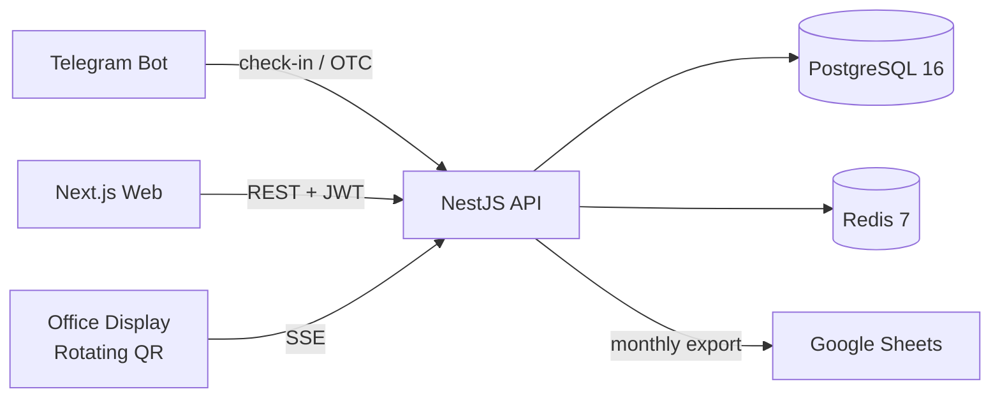

<div align="center">

# ⏱️ Work Tact

**Ритм рабочего дня — time tracking via Telegram and rotating QR codes for B2B offices and B2C freelancers**


</div>

---

## About

<sub>Product codename was **WorkTime**; officially renamed to **Tact** on 2026-04-18. See [REBRAND.md](REBRAND.md).</sub>

Traditional office access-control systems (SKUD) are expensive to install and maintain, while paper attendance logs are unreliable and easy to forge. On the other side of the market, freelancers and remote workers rarely track their real hourly rate, ending the month with a vague sense that they either under- or over-charged every client.

**Tact** solves both problems with one product. For B2B offices, a Telegram bot pairs with a rotating QR code displayed on a screen near the entrance — employees scan, check in, and managers get auto-analytics plus one-click Google Sheets export. For B2C freelancers, the same app turns into a project timer that surfaces your real hourly rate as you work.

## Features

- 📱 **Telegram-First** — Check in via bot + QR, no cards or extra hardware
- 🔄 **Rotating QR** — HMAC-signed, 30s rotation, 45s TTL (anti-fraud)
- 📍 **Geofencing** — Optional GPS check against company coordinates
- 📊 **Auto-Analytics** — Lateness, overtime, punctuality ranking
- 📑 **Sheets Export** — One-click monthly attendance report to Google Sheets
- 💼 **B2C Timer** — Project-based time tracking with real hourly rate insight
- 🎨 **Editorial UI** — Swiss-style design with custom palette and Dial component
- 🔐 **Telegram Auth** — Bot-issued 6-digit codes or Telegram Login Widget
- 🚀 **Production Ready** — Docker, Redis, Sentry, Pino logs, Swagger docs
- 🌍 **i18n** — Russian + English
- 🧩 **Admin Panel** — Cross-company super-admin dashboard
- 💳 **Tier System** — Free / Team / Enterprise with seat limits

## Tech Stack

| Layer         | Technology                                                           |
| ------------- | -------------------------------------------------------------------- |
| Frontend      | Next.js 15, React 19, TypeScript, Tailwind CSS, Framer Motion, Lenis |
| Backend       | NestJS 10, Prisma 5, TypeScript, nestjs-telegraf                     |
| Database      | PostgreSQL 16, Redis 7                                               |
| Infra         | Docker, docker-compose, Nginx, Turborepo, pnpm workspaces            |
| Auth          | JWT (jose), Telegram Login, bot-issued OTC                           |
| Testing       | Jest, Vitest, Playwright                                             |
| Observability | Pino, Sentry, Swagger/OpenAPI                                        |
| DX            | ESLint, Prettier, Husky, lint-staged, Commitlint                     |

## Architecture



The Telegram bot and the office display are the two ingress points for attendance events. The NestJS API signs QR payloads with HMAC, pushes rotations over Server-Sent Events to the display, and persists check-ins to Postgres. Redis holds the short-lived QR nonces and rate-limit counters. The web dashboard is a Next.js client that talks to the same API with JWTs issued by either Telegram Login Widget or a bot-issued one-time code.

## Project Structure

```
WorkTime/
├── backend/                 # NestJS API + Telegram bot
├── frontend/                # Next.js 15 web app
├── packages/
│   ├── database/            # Prisma schema + client
│   ├── types/               # Shared TS types
│   ├── ui/                  # Shared React components
│   └── config/              # ESLint / TS / Tailwind presets
├── nginx/                   # Reverse-proxy config
├── docs/                    # ADRs, architecture, security
├── scripts/                 # Dev + deploy helpers
├── docker-compose.yml
└── turbo.json
```

## Getting Started

```bash
# 1. Clone
git clone https://github.com/foxnaim/WorkTime.git
cd WorkTime

# 2. Install
pnpm install

# 3. Configure
cp .env.example .env

# 4. Start Postgres + Redis
docker compose up -d

# 5. Apply schema + seed
pnpm db:push && pnpm db:seed

# 6. Run all apps
pnpm dev
```

Then open:

- Web — http://localhost:3000
- API — http://localhost:4000
- Swagger — http://localhost:4000/api/docs
- Prisma Studio — `pnpm db:studio`

## Scripts

| Command            | Description                              |
| ------------------ | ---------------------------------------- |
| `pnpm dev`         | Run web + API + bot in watch mode        |
| `pnpm build`       | Build all workspaces via Turborepo       |
| `pnpm lint`        | Lint all packages                        |
| `pnpm test`        | Run Jest + Vitest suites                 |
| `pnpm e2e`         | Run Playwright end-to-end tests          |
| `pnpm db:push`     | Sync Prisma schema to the database       |
| `pnpm db:seed`     | Seed demo company, users, and projects   |
| `pnpm db:studio`   | Open Prisma Studio                       |
| `pnpm docker:up`   | Start infra containers (Postgres, Redis) |
| `pnpm docker:down` | Stop infra containers                    |

## Palette

| Swatch                                                         | Name  | Hex       |
| -------------------------------------------------------------- | ----- | --------- |
|  | Cream | `#EAE7DC` |
|  | Sand  | `#D8C3A5` |
|  | Stone | `#8E8D8A` |
|  | Coral | `#E98074` |
|  | Red   | `#E85A4F` |

## Repositories

GitHub repos still carry their original names; the product is now called **Tact**.

- Monorepo — [foxnaim/WorkTime](https://github.com/foxnaim/WorkTime)
- Backend mirror — [World-Time-back-End](https://github.com/foxnaim/World-Time-back-End)
- Frontend mirror — [World-Time-Frontend](https://github.com/foxnaim/World-Time-Frontend)

## Documentation

- [Architecture Decision Records](docs/adr/)
- [Architecture Overview](docs/ARCHITECTURE.md)
- [Security Checklist](docs/SECURITY_CHECKLIST.md)
- [Backend Docs](backend/docs/)
- [Frontend Docs](frontend/docs/)

## Contributing

Pull requests are welcome. See [CONTRIBUTING.md](CONTRIBUTING.md) for the workflow, commit conventions, and code-style rules.

## License

MIT © [foxnaim](https://github.com/foxnaim)
