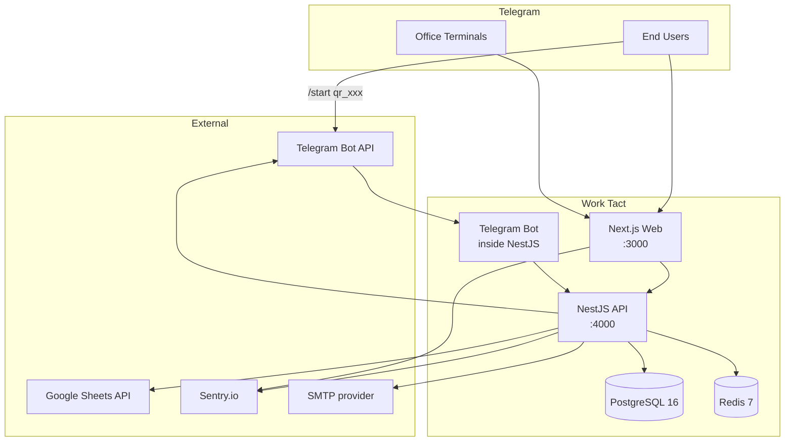
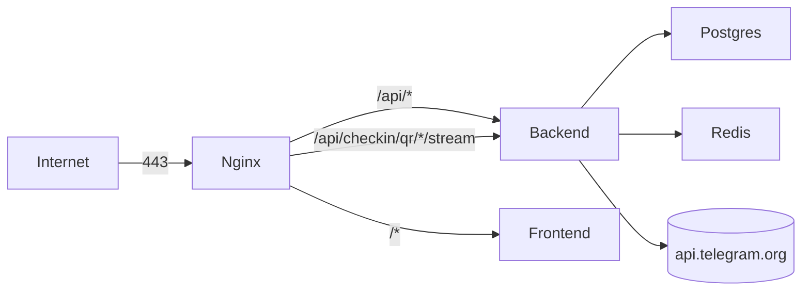
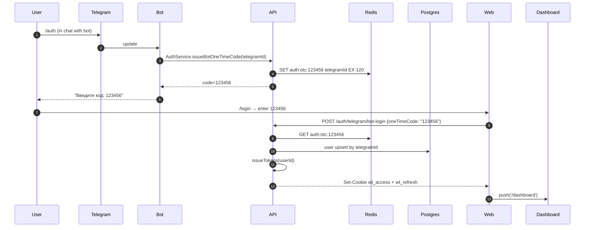
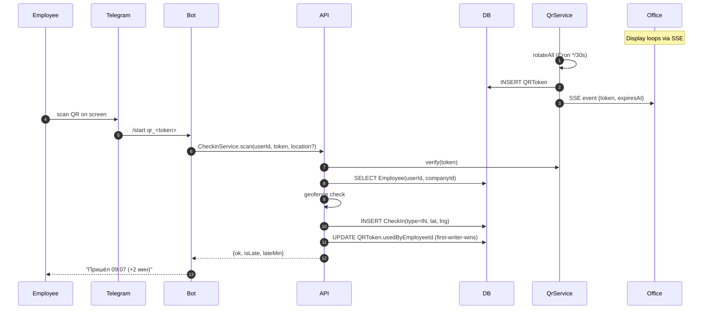
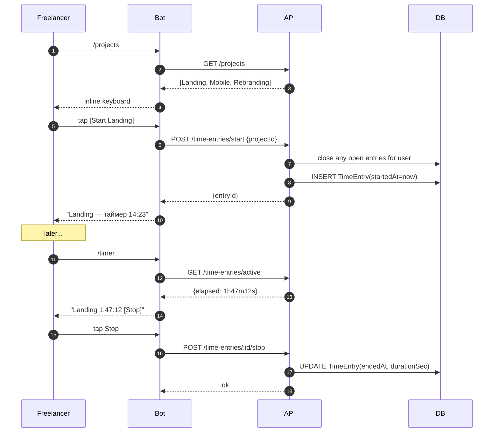
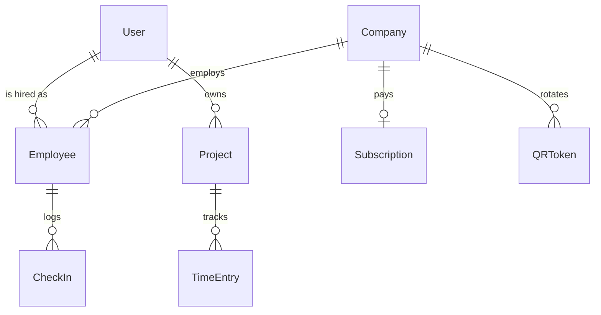

# Work Tact — Architecture

This document is the canonical high-level view of the Work Tact platform: how the
pieces fit together, how a request flows through them, where the data lives, and
how we expect to grow. It is written for engineers joining the team and for
reviewers deciding whether a proposed change respects module boundaries.

Work Tact serves two audiences from one codebase:

- **B2B** — companies running attendance for on-site employees via rotating QR
  codes shown on an office terminal.
- **B2C** — freelancers tracking time against their own projects via the
  Telegram bot.

Both audiences share the same NestJS backend, the same Postgres schema (with
feature flags per company), and the same Telegram bot instance. The Next.js web
app is a thin shell that renders dashboards and the unattended office display.

## System Overview

Two things worth noticing in this diagram. First, the Telegram bot does **not**
own its own process — it is a module inside the NestJS API, wired to the rest
of the services through ordinary DI. That means no cross-process RPC, no second
database pool, and no split of business logic between "bot handlers" and "HTTP
handlers." Both just call the same application services. Second, the office
terminal talks to the Next.js web app the same way any other browser does; the
only difference is the page it lives on (`/office/...`) and the fact that it
keeps an SSE stream open to receive QR rotations.

## Deployment Topology

In the single-VPS topology we ship today, nginx terminates TLS and fans out
based on path prefix. The SSE stream for QR rotation gets its own explicit
route because we need `proxy_buffering off;` and a long read timeout on that
location block — if we let it fall through to the generic `/api/*` rule, nginx
buffers the stream and the office display goes black for minutes at a time.

Postgres and Redis live on the same box in Phase 1; they are reached over the
Docker network, not published to the host. The backend holds the only
outbound connection to `api.telegram.org`: Telegram sends updates to our
webhook, and the backend sends messages back out the same TCP pipe (well,
pool) via the Telegram API.

## Request Lifecycle — Auth

The auth flow is deliberately boring. Telegram has already verified the user's
identity (they own the chat with our bot), so we use a short-lived one-time
code — 6 digits, 120-second TTL, single-use — as a handoff between the bot and
the web session. The OTC lives in Redis and is `GETDEL`'d on consumption, so
replay is impossible even if a code leaks. After the handoff, the session is
standard opaque cookies (access + refresh), with no special Telegram coupling;
users can rotate their Telegram username or number without losing the session.

## Check-in Flow (B2B)

The critical piece is the first-writer-wins update on `QRToken.usedByEmployeeId`.
We rotate tokens faster than human reaction time (every 30 seconds with a 45-
second valid window for tolerance), which means any given token is usually
single-use in practice — but the database enforces it via a `WHERE
used_by_employee_id IS NULL` clause in the update, not via application-level
checking. If two employees somehow scan the same token simultaneously (shared
screen, photo of screen forwarded in a group chat), one wins and the other gets
a retry message. No distributed lock, no Redis semaphore, no drama.

The geofence check happens in-process before the INSERT. It is soft: if the
employee's Telegram-shared location falls outside the company's geofence, we
still record the check-in but flag it for review and surface it in the
admin dashboard. Hard-blocking check-ins on a noisy GPS reading is a recipe
for angry support tickets from employees standing in the lobby.

## Time Entry Flow (B2C)

On the B2C side there is no QR and no geofence — just "start" and "stop." The
one rule we enforce: a user can have at most one open `TimeEntry` at a time.
The `POST /time-entries/start` handler closes any existing open entry with
`endedAt = now()` before inserting the new one, which prevents the "I forgot
to stop the timer yesterday" catastrophe from silently racking up 23 hours.
Users see the auto-close as a polite note in the bot reply: "Closed Landing
(2h 14m), now tracking Mobile."

## QR Rotation Timing

```mermaid
gantt
  dateFormat s
  axisFormat %Ss
  section Token A
  Mint + broadcast :a1, 0, 1s
  Valid window :a2, 0, 45s
  section Token B
  Mint + broadcast :b1, 30, 1s
  Valid window :b2, 30, 45s
  section Scan window
  Both valid (overlap) :s1, 30, 15s
```

The 15-second overlap window between consecutive tokens is not an accident. It
absorbs the cumulative latency of (a) the server minting a token, (b) the SSE
event reaching the office display, (c) the display's canvas repainting, (d) the
employee lifting their phone to scan, and (e) Telegram delivering the resulting
deep link to our bot. Without overlap, any employee unlucky enough to snap a
photo at second 29.8 gets "token expired" on arrival and reaches for support.

## Data Model Summary

`User` is the pivot table between the two audiences. A `User` can simultaneously
be an `Employee` of one or more companies (B2B) and the owner of their own
`Project` list (B2C). That duality is intentional: a café owner who also
freelances on the weekend gets one bot, one login, and one dashboard that shows
both shapes of work.

`CheckIn` and `TimeEntry` are kept in separate tables even though they look
similar. They have different invariants (`CheckIn` is instantaneous and typed
IN/OUT; `TimeEntry` has a start and optional end) and different consumer
reports. Merging them would save perhaps 40 lines of schema at the cost of
forever smearing two product concepts together.

## Module Boundaries

### Backend (src/modules)

Each module owns a bounded context. The rule is: a module can depend on another
module's public `*.service.ts` exports, but never on its repositories, entities,
or internal helpers. Cross-module data access goes through the service, which
is the only thing we promise to keep stable.

- **auth** — identity, tokens, OTC
- **company + employee** — org structure
- **checkin + qr** — B2B attendance (rotating QR)
- **project + time-entry** — B2C freelance tracking
- **telegram** — bot handlers (consumes other modules)
- **analytics** — aggregations (read-only)
- **sheets + report + notification** — export surfaces
- **admin + billing** — platform ops
- **health** — ops concern

The `telegram` module is intentionally a consumer-only node in the dependency
graph. It imports from everywhere, nothing imports from it. That keeps the
bot as a pure presentation layer — if we ever need a second bot (say, a
WhatsApp one), we swap presentation without touching any business logic.

### Frontend (src/app)

Route groups in Next.js App Router map directly to audiences, so the group
name tells you who the page is for and what auth context it runs in:

- `(marketing)` — visitors
- `(auth)` — onboarding funnel
- `(dashboard)` — paying customers (B2B + B2C)
- `(admin)` — platform operators
- `office/` — unattended office terminals

The `office/` route is outside any parenthesised group because it has its own
special-case layout: full-screen, no chrome, hardware-accelerated canvas, and a
cookie-free session (the terminal authenticates via a long-lived device token,
not a user login).

## Scaling Roadmap

### Phase 1 — Single VPS (current)

All services on one box. Handles ~500 companies × 50 employees = 25k users
comfortably, at least in our load tests. The real-world bottleneck on a single
VPS is almost never CPU or memory; it is the Postgres connection pool saturating
during the 9:00 AM check-in stampede when half a city tries to scan at once.
We size the pool conservatively and rely on pg-pool queuing to smooth the spike.

### Phase 2 — Horizontal backend + managed Postgres

Move Postgres to RDS/Neon. Redis Upstash. Backend to 3+ nodes behind nginx.
Bottleneck: DB connections → add PgBouncer. At this phase the Telegram bot
still runs on every backend node, which is fine because Telegram webhooks are
stateless — each update can be handled by any node. Polling mode would not
scale horizontally, which is one of several reasons we are webhook-only.

### Phase 3 — Multi-region

Read replicas per region. Sticky sessions not needed (JWT stateless). Telegram
webhook routed to nearest region via DNS. Writes still go to the primary; we
accept the latency, because check-in writes are bursty and small, and the
office display's SSE stream only needs to see updates within a second or two.

### Phase 4 — Event-sourced reporting

Kafka for CheckIn events → ClickHouse for analytics → Postgres stays OLTP.
This is the "we have real money problems now" phase. The trigger to actually
do this is when the analytics queries start contending with check-in writes
for Postgres I/O — something we will see first in p99 check-in latency
creeping up during end-of-month report generation.

## Non-goals

- We do NOT build a generic CRM
- We do NOT compete with Toggl/Clockify on time-tracking depth
- We do NOT replace corporate SKUD; we serve small/mid orgs that don't have one

Keeping these in writing matters. Every quarter someone proposes a "lightweight
CRM module — we already have the contacts!" or a "Pomodoro mode — it's just a
timer!" Each one is individually reasonable and collectively fatal; the product
wins by being narrower than its competitors, not wider. When a feature request
arrives, the first question is not "can we build it?" — it is "does it make
check-in or time-tracking better for the orgs we serve?"

## Appendix — Where to look next

- **ADRs** — see `docs/adr/` for the specific decisions behind the choices
  summarised here (why NestJS over Fastify-standalone, why rotating QR over
  static QR, why one bot instead of one-per-company, etc.).
- **DOCKER.md** — the actual compose topology, env vars, and volume layout.
- **SECURITY_CHECKLIST.md** — the rules this architecture has to satisfy.
- **README.md** — how to run it locally in under five minutes.
