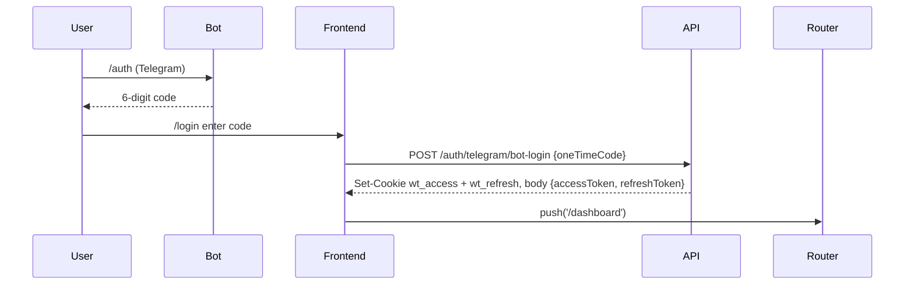

# State Management

This document describes how state flows through the WorkTime frontend. It is
grounded in the actual source files under `src/lib/` and `src/middleware.ts`
and should be treated as the normative reference for adding new state.

## Philosophy

No global store (no Redux/Zustand/Jotai). State lives in three places:

1. **URL & cookies** — auth state, locale, selected company/month.
2. **SWR cache** — server data hydration + mutations.
3. **Component local state** — UI state (modals, hovers, timers).

Server Components are the default; client state is an exception, opted into
with `'use client'` only when a hook or browser API is required.

This keeps the bundle small, the mental model simple, and — crucially —
avoids the double-source-of-truth problem where a store and a cache drift
apart.

---

## Auth State

### Source of truth

- `wt_access` cookie — short-lived JWT (15 min TTL, HS256).
- `wt_refresh` cookie — longer-lived JWT (7 day TTL).
- Both are set by the backend on `/auth/telegram/*` responses.

Cookie names are exported as constants from `src/lib/auth-cookie.ts`:

```ts
export const ACCESS_COOKIE = 'wt_access';
export const REFRESH_COOKIE = 'wt_refresh';
```

### Verification layers

There are three places the access token is verified, and they must stay
consistent:

- **Middleware** — `src/middleware.ts` runs in the Edge runtime, performs a
  cryptographic verify via `jose`, and drives the refresh flow. It is the
  gate for `/dashboard/*` and `/admin/*` routes. A failure here is a
  redirect to `/login`.
- **React Server Components** — `src/lib/auth-server.ts` exposes
  `getServerUser()`, which reads the `wt_access` cookie via `next/headers`
  and calls `verifyAccessToken`. The result is memoised per request with
  React's `cache()` so repeated calls in the same render share one
  verification pass.
- **Client** — `src/components/shared/auth-guard.tsx` hydrates via SWR on
  `/auth/me`. It trusts the middleware for routing; its job is purely
  hydration and reactive re-render on logout.

All three delegate to `verifyAccessToken` in `src/lib/jwt-verify.ts`, which
is deliberately edge-safe: it imports only `jose` and returns `null` on any
failure (bad signature, expired, malformed, missing claims, misconfigured
secret). **It never throws.** Callers write `if (!user) redirect(...)`, not
`try/catch`.

The JWT payload is normalised in `extractUser`: `id` or `sub` is accepted
for the user id, and both `telegramId` and `telegram_id` (snake_case legacy
form) are accepted for the Telegram id.

### Login flow



The backend sets cookies via `Set-Cookie` headers; the frontend also
receives them in the response body, which is useful for non-browser flows
(e.g. Playwright tests).

### Logout

Clear both cookies via `clearAuthCookies()` from `src/lib/auth-cookie.ts`
and navigate: `router.push('/')`. Optionally POST `/api/auth/logout` first
to blacklist the refresh token on the backend.

```ts
import { clearAuthCookies } from '@/lib/auth-cookie';

async function logout() {
  await api.post('/auth/logout').catch(() => {});
  clearAuthCookies();
  router.push('/');
}
```

---

## Data State (SWR)

Wrapper: `src/lib/fetcher.ts`. It accepts either a string key or a tuple
`[path, query]` so components can key on query parameters without building
URL strings by hand.

```ts
export const fetcher = <T>(
  key: string | readonly [string, Record<string, unknown>?],
): Promise<T> => {
  if (typeof key === 'string') return api.get<T>(key);
  const [path, query] = key;
  return api.get<T>(path, { query: query as ... });
};
```

### Conventions

- Key **is** the API path (`/companies/my`). No prefix juggling.
- Always type the response: `useSWR<CompanyResponse[]>('/companies/my')`.
- No `revalidateOnFocus` for heavy endpoints.
- No retry on 4xx (see `shouldRetryOnError` below).
- After a successful `POST` / `PATCH` / `DELETE`, call `mutate(key)` for
  every affected cache entry.

### Example

```tsx
const { data: companies, isLoading } = useSWR<CompanyResponse[]>('/companies/my');

async function invite() {
  await api.post('/companies/abc/employees/invite', body);
  mutate('/companies/abc/employees');
}
```

### Globals via SWRConfig

`src/providers.tsx` wraps the app with a single `SWRConfig`:

```tsx
<SWRConfig value={{
  fetcher,
  shouldRetryOnError: (err) => err?.status >= 500,
  revalidateOnFocus: false,
  dedupingInterval: 4000,
}}>
```

The `shouldRetryOnError` predicate inspects `ApiError.status` (see below)
and suppresses retries for 4xx — there is no point retrying a 401 or 403.
Server errors (>= 500) get the default backoff.

### Cache key patterns

For frequently mutated endpoints, define a module-scoped constants object
so keys are discoverable by grep and can be imported for `mutate()`:

```ts
export const ck = {
  companies: '/companies/my',
  employees: (companyId: string) =>
    `/companies/${companyId}/employees`,
  lateStats: (companyId: string, month: string) =>
    [`/analytics/company/${companyId}/late-stats`, { month }] as const,
};
```

A tuple key with an inline object is stable across renders because SWR
does a deep compare on the key — you do not need to `useMemo` it, but be
mindful that `Date` objects and functions in the query record will break
caching.

---

## URL State

Used for: selected month, pagination cursor, search query, active tab.

Anything that benefits from shareable / bookmarkable URLs goes here rather
than into React state.

```tsx
'use client';

import { useSearchParams, useRouter } from 'next/navigation';

const sp = useSearchParams();
const router = useRouter();
const month = sp.get('month') ?? currentMonth();

function setMonth(next: string) {
  router.replace(`?month=${next}`);
}
```

Use `router.replace` (not `push`) when the URL change is incidental —
picking a month should not add a history entry the user has to click Back
through.

---

## Form State

Uncontrolled forms with native inputs and `FormData` submission where
possible. Controlled components only when real-time validation is needed
(e.g. debounced slug availability).

No `react-hook-form`, no `formik`. Keeping dependencies lean is explicit
policy; a ten-field invite form does not need a form library.

---

## Server Mutations

`src/lib/api.ts` exports `api` with methods `get`, `post`, `patch`, `put`,
`delete`. The wrapper:

- Reads the base URL from `NEXT_PUBLIC_API_URL`, falling back to `/api`.
- Attaches `Authorization: Bearer ${wt_access}` automatically on the client
  via `readAccessToken()` from `src/lib/auth-cookie.ts`.
- Sends JSON unless the body is a `FormData` (in which case `Content-Type`
  is left for the browser to set with its boundary).
- Parses JSON responses and throws `ApiError` on non-2xx.

For SSR paths, pass `token` explicitly (read via `next/headers`) or go
through `getServerUser()`-authenticated fetches. The client-cookie
fallback is deliberately gated on `typeof document !== 'undefined'`, so it
is a no-op during SSR and will never accidentally leak a wrong token.

### Error shape

```ts
export class ApiError extends Error {
  status: number;
  data: unknown;   // parsed response body
  url: string;     // full request URL
}
```

Callers should `instanceof` check:

```tsx
try {
  await api.post('/companies', body);
} catch (e) {
  if (e instanceof ApiError && e.status === 409) {
    toast.error('Slug занят');
  } else {
    toast.error('Ошибка');
  }
}
```

---

## Client-only vs Server Component Rules

Use **client** (`'use client'`) when any of the following are true:

- You need a React hook — `useState`, `useEffect`, `useSWR`, `useRouter`,
  `useSearchParams`.
- You use `framer-motion` or Lenis (both depend on browser APIs).
- You touch browser APIs — `EventSource`, `localStorage`, `navigator`,
  `document`.

Otherwise default to **Server Components**: better time-to-first-byte,
zero JS shipped for that subtree, direct access to `getServerUser()` and
server-side fetches.

---

## Locale State

Cookie `NEXT_LOCALE` (`ru` | `en`) is read in RSC via
`src/i18n/get-locale.ts`. The `LocaleSwitcher` client component writes the
cookie and calls `router.refresh()` so the server re-renders with the new
locale — no client-side string table swap is required.

---

## Toast State

Singleton provider in `src/components/ui/toast.tsx`. Hook:

```ts
const { toast, success, error, dismiss } = useToast();
```

Queue-based, 2s auto-dismiss, live region for screen readers. Toasts are
intentionally not in SWR or URL — they are pure UI ephemera.

---

## Timer State (B2C freelance)

The active time entry is fetched via SWR from `/time-entries/active`. The
displayed elapsed time is computed by a `useElapsed(startedAt)` hook
driven by `requestAnimationFrame` — no polling, no `setInterval`, no
assumption that the window stays focused. When the tab is backgrounded
rAF pauses, and on resume the hook recomputes from `Date.now() -
startedAt`, so the clock is always accurate.

Starting / stopping a timer goes through `api.post` and is followed by
`mutate('/time-entries/active')` to refresh the card.

---

## Telemetry State

Sentry scope is set from the auth context on the client: tags `module`,
`route`, and `user.id` (no PII — no email, no name). Reported via
`@sentry/nextjs`. Server errors are captured from Route Handlers and RSC
via Sentry's automatic instrumentation.

---

## Don't

- Don't add Redux / Zustand / Jotai — the three-places rule above covers
  every case we have encountered.
- Don't use React Context for server data — SWR's cache is already that
  context, keyed on request URL and shared across the tree.
- Don't subscribe to SWR from a Server Component — use `getServerUser()`
  plus a direct `fetch` with the forwarded token instead.
- Don't store the access token in `localStorage`. Cookies only, with
  `SameSite=Lax` and `Secure` on HTTPS — this is the XSS defence.
- Don't call `clearAuthCookies()` and expect middleware to notice on the
  next server render in the same tick; trigger a navigation
  (`router.push('/')`) to force a full auth re-check.
- Don't build URLs by hand in SWR keys; use the tuple form so the query
  object participates in cache identity.
